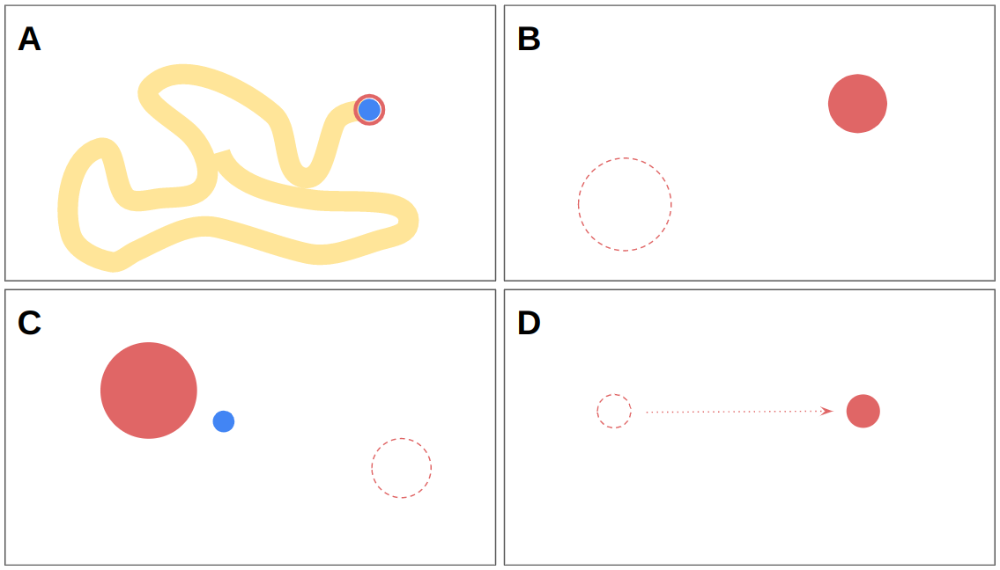

# Characterizing Eye Gaze for Assistive Device Control 
This repository includes the authors' implementation of the eye gaze characterization system presented in "Characterizing Eye Gaze for Assistive Device Control". This work has been accepted to ICORR 2023. The main contributions of this work are three-fold: 
1. A suite of open-source assessment and data gathering tasks for use with an eye gaze tracking interface.
2. An open-source system for interfacing an eye gaze tracker for real-time control, integrated within the Robot Operating System (ROS) software suite.
3. An end-user study that employs these tools to collect data for an individualized characterization of eye gaze for control, to provide further insights into the design of interfaces for systems that use eye gaze as input.

* A: Painting task
* B: Focus task **without** visual feedback
* C: Focus task **with** visual feedback
* D: Tracking task

## Description of packages
* **eyegaze_virtual_tasks** - ROS2 package for interfacing with the Unity package (provided in `argallab_gaze_characterization.unitypackage`) to run and record characterization tasks
    *  Instructions and launch files for the whole pipeline can be found in the README of this package
* **ros2_pyg3_common** - ROS2 package containing custom ROS datatypes used in the provided packages
* **ros2_pyg3_wrapper** - Wrapper for the Tobii Pro Glasses 3 websocket API to interface with ROS2

## Requirements
* Tobii Pro Glasses 3 
* UnityEditor version 2021.3.10f1
* ROS2 (tested with ROS Galactic and Ubuntu 20.04 in a Docker environment)
* Python (tested with python 3.8)
* OpenCV2 (for tag detection)

### Python
* scipy
* numpy
* matplotlib
* websockets

## License
This code is released under the GNU General Public License.